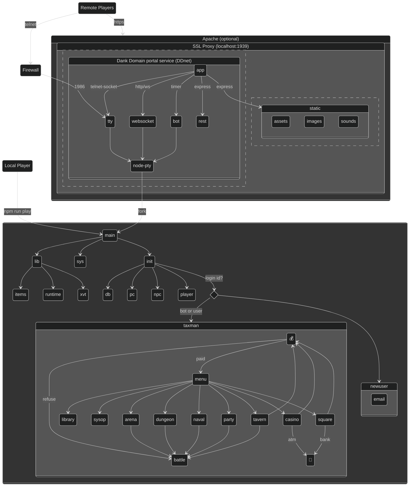

# 🏰 Ɗaɳƙ Ɗoɱaiɳ :: _the return of Hack &amp; Slash_

<a href="https://robert.hurst-ri.us"></a>

- [Player's Manual](#players-manual)
- [Installation](#installation)
- [FAQ](#faq)
- [Files directory structure](#files-directory-structure)
- [Gallery](#gallery)
- [Node.js dependency tree](#nodejs-dependency-tree)

---


## Player's Manual

_Read the_ [Manual](https://manual.ddgame.us) _to play the_ [online game](https://play.ddgame.us)

---
>**Ɗaɳƙ Ɗoɱaiɳ** is the re-imagined classic Amiga bulletin board, [Hack & Slash](https://github.com/theflyingape/rpgbbs), built around a medieval role-playing atmosphere. Your character kills, steals, brawls, and jousts other PCs, NPCs, and BOTs to gain levels and fortune. Successful ventures into the deep dank dungeon are key to immortality.

*Original Commodore Amiga* **Hack & Slash** *enthusiasts can visit:*  [Absinthe BBS](https://www.telnetbbsguide.com/bbs/absinthe-bbs/) *by Anachronist*

---
<pre>sudo systemctl start dankdomain-portal</pre>
---



[](https://nodei.co/npm/dankdomain/)

[](https://open.vscode.dev/theflyingape/dankdomain) _... or just press_ `dot (.)` _on your keyboard_

  

## Installation

Project development on `Chrome OS` and `Linux` with the `Node.js` runtime. To run a local game copy, click the `VS Code` icon above or manually [install](https://www.npmjs.com/package/dankdomain):

```bash
# fetch this package source:
$ git clone https://github.com/theflyingape/dankdomain
# ... or via Node.js
$ npm install dankdomain

# cd into package source folder:
$ npm install

# 1) play it as standalone:
$ npm run play

# modify for your server networking preferences:
$ cp etc/network.json_inet etc/network.json
$ vim etc/network.json

# 2) run it as a local multiuser server:
$ npm run net &
$ npm run term
$ npm stop

# 3) other ways to play online:
$ npm run mame
$ npm run term play.ddgame.us
$ telnet play.ddgame.us
Connected to play.ddgame.us.
Escape character is '^]'.
CARRIER DETECTED
PC emulation enabled
            ...........|\...................../|................. Welcome to
             ........./  \..|\__  __/|......./  \............... Dank Domain
            ........./ /  \.\ _ \/ _ /....../    \.............
      _  .........../ / /  \.(-)\/(-)....../  / \ \.............
     (_)  ..........| | | / \\/(oo)\/...../  // |\ \.............
          ..........| | | |  \|v--v|\..../  / | || \|...........
        ............| | | | / \_^^_/ \../  / || || ||.............
           ......../ / /  | |   \/    \/  /| || || ||/\../\....
            /\..../ / /  / /  |______/   /| \ \ || ||  \/  \    /\        /\
 /\      /\/  \../ / /  / /  /\_____/  |/ /__\ \ \ \ \ /    \  /  \  /\  /  \
/  \/\  / /    \.| | | / /  /\______/    \   \__| \ \ \      \/    \/  \/    \
    \ \/        \| | | | | |\______       \_    \__|_| \     /      \  /
     \/          | | ____ /\______ ____     \_       \  |   /         /
      \          | |/    /\_____  /    \      \__     \ |
       \         |/ |   |\______ |      |        \___  \|
                    |   |\______ |      |            \_
            _   ___/|   |\______ |      |          /\  \   ___
           / \_/     \   \________\_    _\____/   /  \__\_|   \
       ___/ __     __/   /       __/   /__    \__/      __     \__
     _/    /  \   /  ___/       /  ___/   \            /  \       |__
    |     |      |/|/          |/|/        \__    \        \         |

Who dares to enter my dank domain <or NEW>?
```

**NOTE**: _my_ "public" _access [packages](https://github.com/theflyingape?tab=packages&visibility=public) are published on_ **GitHub** _and it requires your_ `Personal Access Token` authentication _to fetch/install them from this alternative_ `npm registry`. Read GitHub's [Working with the npm registry](https://docs.github.com/en/enterprise-server@2.22/packages/working-with-a-github-packages-registry/working-with-the-npm-registry#authenticating-to-github-packages) to learn more details.

```bash
# setup local Node.js package
$ npm config set @theflyingape:registry https://npm.pkg.github.com
$ npm login --scope=@theflyingape
$ npm install @theflyingape/dankdomain
```

... or use **Docker** _(convenient and uses the latest commits)_:

```linux
$ docker pull theflyingape/dankdomain
$ docker run --rm -it -p 1939:1939/tcp -p 1986:1986/tcp theflyingape/dankdomain

Dank Domain (DDnet) started on linux #661
cwd /usr/games/dankdomain/game → /usr/games/dankdomain/game/portal
initializing Deeds
initializing Online
initializing Rings (unique)
 + adding ⚛️ Atomic
 + adding ✝️ Faith
 + adding ♾️ Infinity
 + adding 🐍 Medusa's
 + adding 🕳️ Mystic Portal
 + adding 👹 Ogre
 + adding 🖤 Undying
 + adding ⚪ White Wizard
initializing Players
initializing Gangs
 + adding AB Original with BOT+NPC members
 + adding (the) Monster Mash
ENOENT: no such file or directory, open '/usr/games/dankdomain/game/etc/network.json'
→ listening on telnet 0.0.0.0:1986
→ listening on https://0.0.0.0:1939/
↔ WebSocket endpoints enabled
```

Supports running as a BBS door (as Amiga-only BBSes did for `Hack & Slash` in 1994) by allowing a passed user numeric ID paired with a compatible **Mystic** `door.sys` [file format](http://wiki.mysticbbs.com/doku.php?id=menu_commands#external_doors) launched from its `BBS node` startup directory. Here is how to _freshly_ unit-test that app startup mode:

```bash
[~/dankdomain]$ npm run clean
[~/dankdomain]$ cd game
[~/dankdomain/game]$ cp door-example.sys door.sys
[~/dankdomain/game]$ node main 0
```

For example, configure to call-out to a script with two (2) parameters: `userId` and the path with filename to `door.sys`

```bash
#!/bin/sh
pwd; [ -s "$2" ] || exit 1
cp "$2" /usr/local/games/dankdomain/door.sys
node /usr/local/games/dankdomain/main "$1"
```

## FAQ

- What does `etc/sysop.json` do? How do you assign sysop privileges?

_This file simply regulates some of the game features loaded at_ `runtime`_. The first Player (non-NPC) to register is automatically entitled as the Ruler off the last object entry in_ `files/items/title.json` _which is packaged here as either the_ (M) King _or_ (F) Queen `access` _role. The Ruler alone is granted with minor "favor" over their domain, but aligned with the game play & spirit if not abused. Other roles can have_ `sysop: true` _enabled to gain access to_ `"@"` _and some overlapping favor with the Ruler as you'd expect from a minion._

**NOTE**: _in_ `users` _folder, edit a hidden (dot) export file to carefully modify any Player's record and save as_ **`save.json`** _whereas a running DDnet_ `app.js` _portal service_ (`npm run net`) _will automatically consume and apply it to the_ `dankdomain.sql` **`Players`** _table._

- What's the best way to modify Player time limits and timeouts throughout the game?

_Refer to_ `files/items/title.json` _for player runtime values based on their_ `access` _role -- assigned or achieved by reaching the next_ `promote` _level. There are no soft-coded values for the timeouts assigned to the various prompts. Those have been specially tweaked to keep turn-play moving along -- appropriately. That said, try modifying_ `vt.defaultTimeout` _seconds in_ `main.js` _to your liking._

## Files directory structure

For the Portal, consider downloading media packs: 📷 [images](https://drive.google.com/open?id=1jjLPtGf_zld416pxytZfbfCHREZTghkW) and 🔉 [sounds](https://drive.google.com/open?id=1UvqQJbN61VbWVduONXgo1gm9yvGI0Qp8) into the appropriate game/portal/static folder:

```linux
$ pwd
/usr/games/dankdomain
.vscode           Visual Studio Code: settings & debug profiles
game
  etc             sysop support files
  files           game, menu & player support files: ANSI and/or text formats
    arena         ASCII art & menu files
    casino        menu files
    dungeon       ASCII art
    items         game artifacts
    library       deeds & menu files
    main          about system & menu files
    naval         ASCII art & menu files
    party         instruction & menu files
    player        ASCII art
    square        menu files
    tavern        all player events logged for the day
    user          each player’s events logged since last visit
  pcs             user object type templates for BOTs, NPCs, and PCs
  play            game modules for each main menu item
    battle.js     support module for player engagements
    init.js       support module for initial login
    runtime.json  game play runtime values
    sysop.js      support module for the system operator - main menu "@" command
  portal
    static        UI html/css/js using bundle.js: client.js & xterm.js
      assets      app install, fonts, etc.
      images      visual media for artifacts, creatures, and players
      sounds      audio media for event notifications
    app.js        DDnet for optional web and/or telnet services to run DDplay remotely
  users           player runtime database & current game files
  db.js           net & play module for player runtime database & files
  email.js        support module for (optional) dispatching email notifications
  interfaces.js   TypeScript object types
  items.js        support module for loading item artifacts & coin
  lib.js          support module for common I/O functions
  main.js         DDplay client node
  npc.js          support classes for BOTs & NPCs with arena, dungeon, and naval denizens
  pc.js           support classes for PCs with Deeds
  player.js       support module for common PC functions
  runtime.js      global runtime variables to govern play
  sys.js          support module with discrete functions to dependencies
  telnet.js       telnet client using websocket and XT emulator handling
  types.js        TypeScript template literals
mame              player - MAME VT240 terminal + socat startup script
node_modules      Node.js support libraries
package.json      Node.js manifest
```

 🇺🇸 ©️1991 - 2023 [Robert Hurst](https://www.linkedin.com/in/roberthurstrius/)

## Gallery

- [Arena](https://photos.app.goo.gl/sZS7xx6rpyoG4CYBA)
- [Connect](https://photos.app.goo.gl/AeZZXrC8VKnMFuqj8)
- [Dungeon](https://photos.app.goo.gl/XfQTJ2NrKdVWJext9)
- [Images](https://photos.app.goo.gl/wXpBUtrY2L64SrEH6)
- [Monster](https://photos.app.goo.gl/rTRm8xDbF2wGJDFZ7)
- [Naval](https://photos.app.goo.gl/w6v8Zk4GVBc3CbAA6)
- [NPC](https://photos.app.goo.gl/T4QQT87U1eZK6EHk8)
- [Player](https://photos.app.goo.gl/BCEAJjynqHZKxpaX9)
- [Potion](https://photos.app.goo.gl/Gj9HYSXQUDGVcviJ7)
- [Ring](https://photos.app.goo.gl/SWQDdytqjdXNfT4m7)
- [Specials](https://photos.app.goo.gl/Dn2g2BtdwtKSbudu7)
- [User](https://photos.app.goo.gl/hfTJ8EstLPSp4Kry6)

## Node.js dependency tree

**DDnet** portal

**`app`**

- `chokidar`, `dns`, `express`, `fs`, `http`, `https`, `net`, `node-pty`, `ws`
- `sys`: `fs`, `got`, `path`, `romanize`, `sprintf-js`, `title-case`
- `items`: sys
- `db`: `better-sqlite3`, items, sys
- _network service options_
  - telnet: `net-keepalive`, `telnet-socket`
  - web: `url`

**`client`**

- `animate.css`, `browserify`, `xterm`, `xterm-addon-fit`, `xterm-addon-unicode11`, `xterm-addon-web-links`, `xterm-addon-webgl`

**DDplay** game

**`main`**

- `sys`: `country-flag-emoji`, `fs`, `fast-geoip` `got`, `path`, `romanize`, `sprintf-js`, `title-case`
- `lib`: items, runtime, sys, `xvt`
  - `items`: sys
  - `runtime`: sys
- `init`: db, items, lib, npc, pc, player, runtime, sys
  - `db`: `better-sqlite3`, items, sys
  - `pc`: db, items, lib, runtime, sys
  - `npc`: db, items, lib, pc, runtime, sys
  - `player`: db, items, lib, npc, pc, runtime, sys
  - `email`: db, items, lib, `nodemailer`, `nodemailer-smtp-transport`, pc, runtime, sys
  - `newuser`: db, email, init, items, lib, pc, runtime, sys
  - `taxman`: db, items, lib, pc, player, runtime, sys
    - `battle`: db, items, lib, npc, pc, player, runtime, sys
    - `menu`: battle, db, items, lib, npc, pc, player, runtime, sys
      - `arena`: battle, db, items, lib, npc, pc, player, runtime, sys
      - `casino`: db, items, lib, npc, pc, player, runtime, sys
      - `dungeon`: battle, db, items, lib, npc, pc, player, runtime, sys
      - `library`: db, items, lib, npc, pc, runtime, sys
      - `naval`: battle, db, items, lib, npc, pc, player, runtime, sys
      - `party`: battle, db, items, lib, npc, pc, player, runtime, sys
      - `square`: battle, db, items, lib, npc, pc, player, runtime, sys
      - `sysop`: battle, db, dungeon, email, lib, pc, player, runtime, sys
      - `tavern`: battle, db, items, lib, npc, pc, player, runtime, sys, taxman
